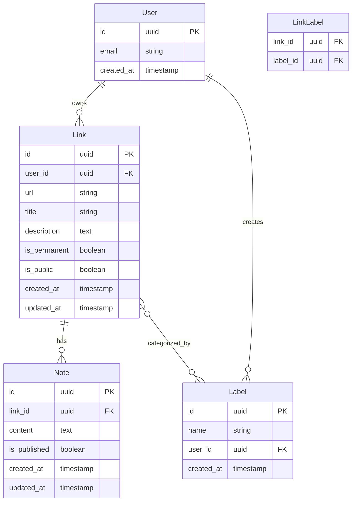

# LinkedList Data Model

This document describes the core data model and relationships for the LinkedList application.

## Entity Relationship Diagram

## Core Entities

### User
- Represents an authenticated user of the system
- Links to authentication providers via Lucia
- All content is associated with a user

### Link
- Central entity representing a saved URL
- Can be permanent (like a WordPress page) or temporal (like a post)
- Has visibility controls (public/private)
- Can be categorized with multiple labels

### Note
- Chronological entries associated with a specific link
- Supports markdown content
- Private by default, can be published

### Label
- User-defined categorization terms
- Used to organize and discover links
- Each user has their own set of labels

### LinkLabel
- Junction table to support many-to-many relationship between links and labels

## Key Relationships

1. Each user owns multiple links and labels
2. Each link can have multiple notes, ordered chronologically
3. Links can be categorized with multiple labels
4. All entities maintain audit timestamps (created_at, updated_at)

## Security Considerations

- Row-level security in Supabase will enforce user data isolation
- Public/private visibility will be enforced at the database level
- Publishing workflow will control note visibility