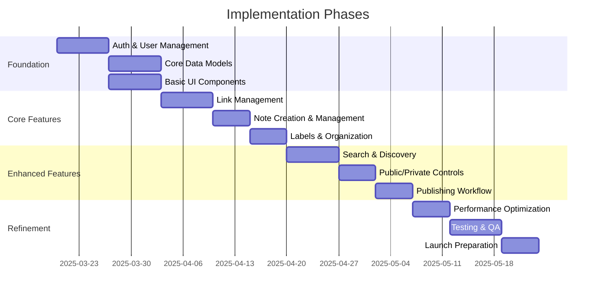

# LinkedList Implementation Phases

This document outlines the planned implementation phases for the LinkedList application, breaking down the work into logical stages.

## Implementation Timeline

## Phase Details

### Foundation Phase

#### Auth & User Management
- Set up Lucia auth with multiple providers
- Implement login, logout, and registration flows
- Create user profile management
- Set up session handling

#### Core Data Models
- Create Supabase tables and relationships
- Implement Row-Level Security policies
- Set up database indexes and constraints
- Create TypeScript types for all entities

#### Basic UI Components
- Create component library foundations
- Implement layout templates
- Design system setup with TailwindCSS
- Build navigation and user interface shell

### Core Features Phase

#### Link Management
- Create, read, update, delete links
- Link categorization (permanent vs temporal)
- URL validation and metadata extraction
- Basic link listing and details views

#### Note Creation & Management
- Chronological note creation for links
- Note editing interface
- Markdown support
- Note listing and viewing

#### Labels & Organization
- Label creation and management
- Link labeling functionality
- Label-based filtering
- Organization interface

### Enhanced Features Phase

#### Search & Discovery
- Full-text search implementation
- Advanced filtering capabilities
- Combined search across links and notes
- Search results UI

#### Public/Private Controls
- Public/private toggle for links
- Visibility management interface
- Public link sharing features
- Privacy indicators

#### Publishing Workflow
- Note publishing functionality
- Publishing interface
- Visibility controls for published content
- Public viewing experience

### Refinement Phase

#### Performance Optimization
- Query optimization
- UI performance improvements
- Load testing and bottleneck resolution
- Caching implementation

#### Testing & QA
- Unit test coverage
- Component tests
- End-to-end testing
- Bug fixing and polish

#### Launch Preparation
- Documentation completion
- Final security review
- Deployment pipeline setup
- Pre-launch checklist

## Decision Points & Milestones

Each phase includes specific decision points that may impact subsequent work:

1. **Authentication Provider Selection** (Foundation Phase)
   - Validate all three auth providers work as expected
   - May require adjustments based on provider constraints

2. **Data Model Validation** (Core Features Phase)
   - Review query performance with real data
   - Potential schema adjustments based on usage patterns

3. **Search Implementation Approach** (Enhanced Features Phase)
   - Evaluate Postgres search performance
   - Decide if additional search infrastructure is needed

4. **Performance Assessment** (Refinement Phase)
   - Identify performance targets and measure against them
   - Make architectural adjustments if needed