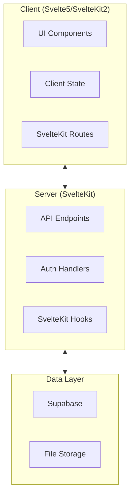

# LinkedList System Architecture Overview

This document provides a high-level overview of the LinkedList application architecture.

## System Components

## Key Technologies

- **Frontend**: Svelte 5, SvelteKit 2, TypeScript, TailwindCSS
- **Backend**: SvelteKit API routes, Lucia Auth
- **Data Storage**: Supabase (PostgreSQL)
- **Authentication**: Lucia with Bluesky, GitHub, and Google providers
- **Deployment**: Vercel
- **Testing**: Vitest

## Architecture Principles

1. **Component-based architecture** for frontend with clear separation of concerns
2. **Data isolation** through user-scoped queries and row-level security
3. **Progressive enhancement** with server-side rendering where appropriate
4. **API-first design** for all data operations
5. **Multi-tenancy** support from the beginning