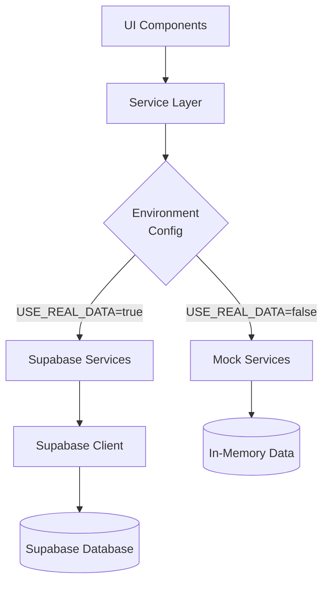

# LinkedList Project Progress

## Target Goal
Get LinkedList fully functional with a Supabase backend, focusing on real data persistence and implementing core functionality with proper authentication.

## Current Status - Supabase Integration Complete ✅

We have successfully integrated Supabase as the persistence layer for the LinkedList application, allowing for a smooth transition from mock data to real database storage.

### Completed Tasks:

#### 1. Project Setup ✅
- Created a new SvelteKit project with TypeScript
- Set up TailwindCSS for styling
- Configured ESLint and Prettier for code quality
- Created the basic project structure

#### 2. Basic UI Components ✅
- Implemented AppLayout with header and navigation
- Created LinkCard component for displaying links
- Implemented LinkForm for adding and editing links
- Set up responsive design with TailwindCSS

#### 3. Data Model Implementation ✅
- Created TypeScript interfaces for core entities (User, Link, Note, Label)
- Implemented mock data services for development
- Set up reactive stores with Svelte
- Created a mock database implementation for local development

#### 4. Core Pages Implementation ✅
- Created home/dashboard page
- Implemented link listing view with filtering
- Created link detail view with notes
- Added link creation and editing interfaces
- Implemented labels management page

#### 5. Mock Authentication ✅
- Created login page with mock authentication
- Implemented simple client-side auth store
- Set up for future integration with Lucia

#### 6. Supabase Integration ✅
- Created Supabase client configuration with conditional initialization
- Implemented real data services using Supabase
- Set up service switcher for graceful fallback to mock data
- Created database schema creation script with error handling
- Added connection testing script for validation
- Implemented Row-Level Security policies for development
- Added comprehensive documentation for setup and troubleshooting

## Current Architecture

The application now follows a dual-mode architecture:

The Supabase implementation includes:

1. **Database Schema**: Tables for users, sessions, links, notes, labels, and relationships
2. **Row-Level Security**: Development-friendly policies that can be enhanced for production
3. **Service Layer**: Full implementation of all data operations using the Supabase client

## Immediate Next Steps

1. **Authentication Implementation**
   - Set up Lucia auth with the Supabase adapter
   - Configure social authentication providers (Bluesky, GitHub, Google)
   - Update RLS policies to use authenticated user IDs

2. **Enhanced Data Validation**
   - Add input validation for all forms
   - Implement error handling for database operations
   - Add optimistic UI updates for smoother user experience

3. **Search and Discovery Features**
   - Implement full-text search using Supabase
   - Add filter and sort options for links and notes
   - Improve label-based organization

## Future Enhancements

1. **Public/Private Controls**
   - Implement visibility settings for links and notes
   - Add sharing functionality for public content
   - Create public view templates

2. **Publishing Workflow**
   - Develop publishing process for notes
   - Add version history for published content
   - Implement markdown rendering for published notes

3. **Performance Optimization**
   - Implement caching for frequently accessed data
   - Add pagination for large data sets
   - Optimize database queries for common operations

## Technical Achievements

- **Clean Architecture** - Clear separation between UI, data, and logic
- **Type Safety** - Comprehensive TypeScript interfaces for all entities
- **Reactive UI** - Leveraging Svelte 5's reactivity model
- **Progressive Enhancement** - Development with or without a database
- **Developer Experience** - Simple environment toggling for local development
- **Deployment Ready** - Structured for easy Vercel deployment

## Lessons Learned

- Handle environment variables carefully for proper database connections
- Test database connectivity early in the integration process
- Structure Row-Level Security policies for development vs. production
- Use connection pooling for more reliable Supabase connections
- Create robust error handling for graceful fallbacks